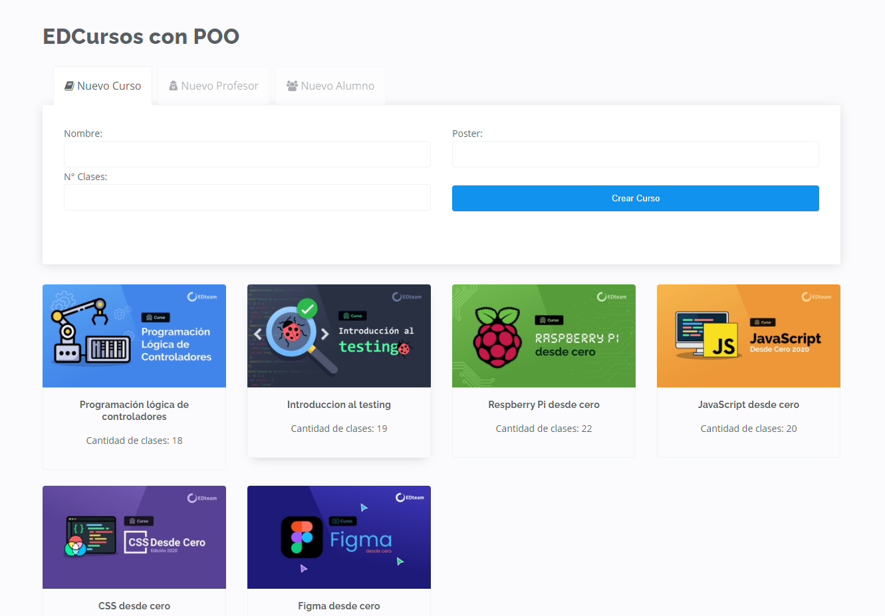
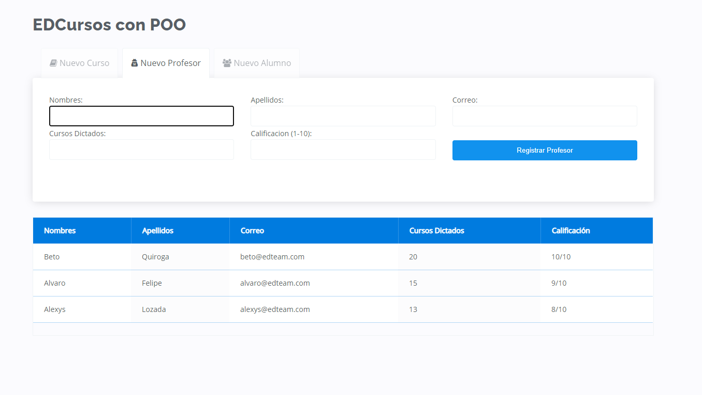
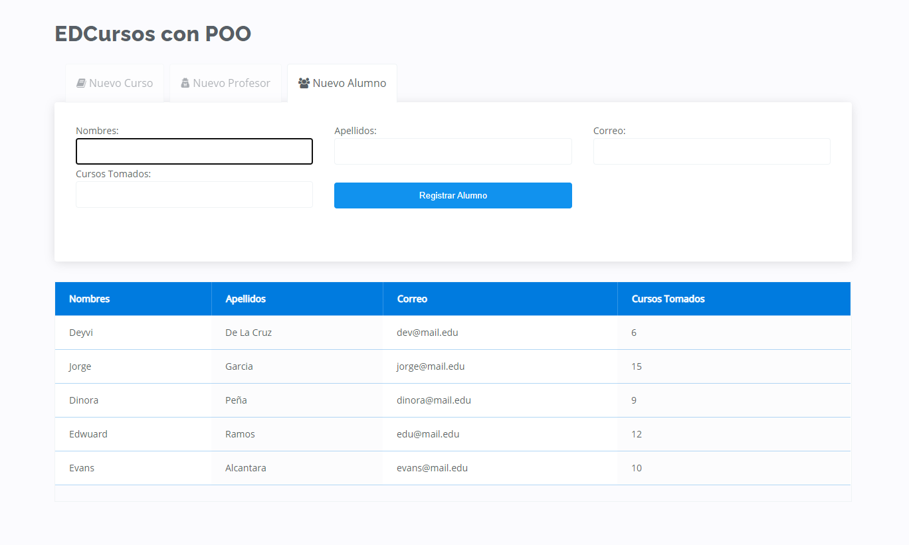

# Proyecto final - Curso JS-POO en EdTeam

Pequeña aplicación que permite registrar cursos, usuarios y Profesores.
Los Usuarios pueden ser profesores o alumnos, y lo resolvimos mediante herencia de clases.

## Recursos usados
* Curso JavaScript en el Navegador
* Curso Git desde cero
* Curso Markdown desde cero
* EDteam guia de estilos: https://ux.ed.team/

## Capturas

### Cursos

### Profesores

### Alumnos

